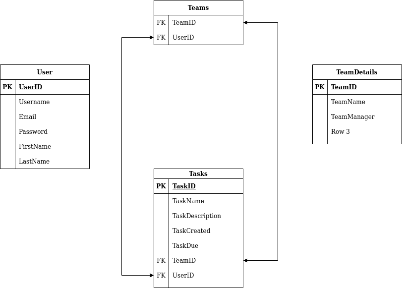

# taskmanager
taskmanager lets you organize your own tasks or the tasks for a team.
Inspiration is taken from apps like [Todoist](https://todoist.com).

## Structure

This repo is a monorepo.

### Frontend

The part for the frontend lies in [src](src). The folder contains a react app which gets bundled by [webpack](https://webpack.js.org/)
The common config for webpaack is in [webpack.config.common.js](webpack.config.common.js). This config contains settings which are used for both the [dev-server](webpack.config.dev.js) and the [production build](webpack.config.).
While the [dev-server](webpack.config.dev.js) doesn't contain any optimizations except hashing, the [production build](webpack.config.prod.js) supports minifying and chunking, to decrease the traffic on the user.

### Backend

The backend is a [express](https://expressjs.com/) app. It provides a REST-API to serve data to the frontend. [JWT](https://jwt.io/) is used for session management / auth.
[pg](https://node-postgres.com/) is used to interact with the Postgres database.

### Database
The database schema is fairly simple for now but it will groow with added features.


## Installation

Simply clone this repo and run
```
npm install
```
which installs all the dependencies that are necessary

After that create a .env file with the following content or set them in your shell
```
PG_HOST
PG_PORT
PG_USER
PG_PW
PG_DB
JWT_SECRET
EXPRESS_PORT // Optional if you want run the server on a different port than 6060
```
